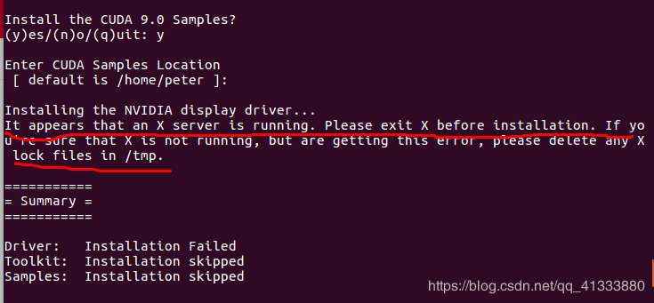

#   VL-BERT安装及问题记录
本文档是通过复现VL-BERT开源框架的过程，详细说明其安装步骤和安装中存在的问题。
##  VL-BERT安装
从 [https://github.com/jackroos/VL-BERT](https://github.com/jackroos/VL-BERT) 下载源码
### 工程目录
见[project.md](project.md)

### 安装配置步骤
    １．按照./data/PREPARE_DATA.md 准备数据
### 报错环节及错误解决方案
bottom_up_attention工程目标是通过generate_tsv_v2.py下载对应的图片数据集并存放在./data/train_frcnn/和./data/val_frcnn/下，具体编译bottom_up_attention，出现编译错误：
１．  进入bottom_up_attention后　新建python2.7的虚拟环境
```bash
conda create -n cc python=2.7 pip
conda activate cc
pip install Cython numpy Pillow
```
２．  然后进入lib目录
输入:
```
make
```
输出:
```error
python setup.py build_ext --inplace
running build_ext
skipping 'utils/bbox.c' Cython extension (up-to-date)
skipping 'nms/cpu_nms.c' Cython extension (up-to-date)
skipping 'nms/gpu_nms.cpp' Cython extension (up-to-date)
skipping 'pycocotools/_mask.c' Cython extension (up-to-date)
rm -rf build
```
不清楚是编译成功，还是编译失败
3.  进入caffe目录
输入:
```buildoutcfg
make -j8 && make pycaffe
```

错误
```error
NVCC src/caffe/util/im2col.cu
NVCC src/caffe/util/math_functions.cu
make: /usr/local/cuda/bin/nvcc: Command not found
make: /usr/local/cuda/bin/nvcc: Command not found
Makefile:594: recipe for target '.build_release/cuda/src/caffe/util/im2col.o' failed
make: *** [.build_release/cuda/src/caffe/util/im2col.o] Error 127
make: *** Waiting for unfinished jobs....
Makefile:594: recipe for target '.build_release/cuda/src/caffe/util/math_functions.o' failed
make: *** [.build_release/cuda/src/caffe/util/math_functions.o] Error 127
NVCC src/caffe/layers/concat_layer.cu
make: /usr/local/cuda/bin/nvcc: Command not found
Makefile:594: recipe for target '.build_release/cuda/src/caffe/layers/concat_layer.o' failed
make: *** [.build_release/cuda/src/caffe/layers/concat_layer.o] Error 127
```
错误原因找不到对应的cuda库及相关文件，还在进一步检查原因

4.  原因是找不到cuda版本
解决方案：重新安装对应的cuda9，同时也安装了cuda10,并对系统做软连接和本地bashrc配置

4.1 cuda config
4.1.1 系统配置
>sudo chmod 775 /usr/bin/nvcc
>sudo vim /usr/bin/nvcc
```buildoutcfg
exec /home/wxw/cuda-XX/ "$@"
```
4.1.2 bashrc修改　~/.bashrc文件末尾添加
>vim ~/.bashrc
```buildoutcfg
export PATH=$Home/cudaXX/bin:$PATH
export LD_LIBRARY_PATH=$HOME/cudaXX/lib64
```
>source ~/.bashrc　#　注意重启启动配置环境
   
4.2 安装cuda报错
```buildoutcfg
It appears that an X server is running. Please exit X before installation.
```


注意不要安装驱动，否则会报
解决方案：在sudo sh cuda_9.0.176_384.81_linux.run，之后会提示安装信息，安装驱动的时候一定要选择no 


4.3 cuda9的源码目录下没有cudnn.h:{cuda project}/include/cudnn.h No file or directory　所以caffe/include/caffe/util/cudnn.hpp中
```cpp
#ifndef CAFFE_UTIL_CUDNN_H_
#define CAFFE_UTIL_CUDNN_H_
#ifdef USE_CUDNN

#include <cudnn.h> -->　是找不到的
```
所以将cuda10的源代码目录{cuda10 project}/include/cudnn.h　拷贝到了 /bottom_up_attention/caffe/include/caffe/utils/目录，同时修改cudnn.hpp为
```cpp
#ifndef CAFFE_UTIL_CUDNN_H_
#define CAFFE_UTIL_CUDNN_H_
#ifdef USE_CUDNN

#include "cudnn.h"
```

４.4　解决nccl.h问题，继续编译caffe 出现找不到nccl.h头文件
具体错误
```make error
In file included from ./include/caffe/parallel.hpp:19:0,
                 from ./include/caffe/caffe.hpp:13,
                 from tools/caffe.cpp:15:
./include/caffe/util/nccl.hpp:5:18: fatal error: nccl.h: No such file or directory
compilation terminated.
Makefile:591: recipe for target '.build_release/tools/caffe.o' failed
make: *** [.build_release/tools/caffe.o] Error 1
make: *** Waiting for unfinished jobs...
```
解决方案
```buildoutcfg
git clone https://github.com/NVIDIA/nccl.git
cd nccl
sudo make install -j4
sudo ldconfig
```
但这里又会出现 nccl　编译错误,错误原因是之前的cuda和nvcc版本不一致(必须是cuda９对应的nvcc或cuda10对应的nvcc)
```buildoutcfg
sudo make install -j4 -->会报错

Generating rules                               > /home/wxw/projects/nccl/build/obj/collectives/device/Makefile.rules
In file included from /usr/local/cuda/bin/..//include/host_config.h:50:0,
                 from /usr/local/cuda/bin/..//include/cuda_runtime.h:78,
                 from <command-line>:0:
/usr/local/cuda/bin/..//include/crt/host_config.h:119:2: error: #error -- unsupported GNU version! gcc versions later than 6 are not supported!
 #error -- unsupported GNU version! gcc versions later than 6 are not supported!
  ^~~~~
Makefile:52: recipe for target '/home/wxw/projects/nccl/build/obj/collectives/device/sendrecv.dep' failed
make[2]: *** [/home/wxw/projects/nccl/build/obj/collectives/device/sendrecv.dep] Error 1
make[2]: Leaving directory '/home/wxw/projects/nccl/src/collectives/device'
Makefile:50: recipe for target '/home/wxw/projects/nccl/build/obj/collectives/device/colldevice.a' failed
make[1]: *** [/home/wxw/projects/nccl/build/obj/collectives/device/colldevice.a] Error 2
make[1]: *** Waiting for unfinished jobs....
make[1]: Leaving directory '/home/wxw/projects/nccl/src'
Makefile:25: recipe for target 'src.install' failed
make: *** [src.install] Error 2

```

解决方案：

统一nvcc和cuda　编辑/usr/bin/nvcc　让它指向cuda10/bin/nvcc　同时调整/usr/local/下cuda软连接，具体做法是
```buildoutcfg
>sudo vim /usr/bin/nvcc 
```

```buildoutcfg
exec /home/wxw/cuda10/bin/nvcc "&@"
```
```buildoutcfg
>sudo ln -s /home/wxw/cuda10 cuda
```

```buildoutcfg
cuda -> /home/wxw/cuda10/
```
然后在{nccl project}执行
```buildoutcfg
>sudo make install -j4
>sudo ldconfig
```
执行结果
```buildoutcfg
(base) wxw@ubuntu-PowerEdge-C4140:~/projects/nccl/build$ cd ..
(base) wxw@ubuntu-PowerEdge-C4140:~/projects/nccl$ sudo make install -j4
make -C src install BUILDDIR=/home/wxw/projects/nccl/build
make[1]: Entering directory '/home/wxw/projects/nccl/src'
make[2]: Entering directory '/home/wxw/projects/nccl/src/collectives/device'
Compiling  sendrecv.cu                         > /home/wxw/projects/nccl/build/obj/collectives/device/sendrecv_sum_i8.o
Compiling  sendrecv.cu                         > /home/wxw/projects/nccl/build/obj/collectives/device/sendrecv_sum_u8.o
Compiling  sendrecv.cu                         > /home/wxw/projects/nccl/build/obj/collectives/device/sendrecv_sum_i32.o
Compiling  sendrecv.cu                         > /home/wxw/projects/nccl/build/obj/collectives/device/sendrecv_sum_u32.o
Compiling  sendrecv.cu                         > /home/wxw/projects/nccl/build/obj/collectives/device/sendrecv_sum_i64.o
Compiling  sendrecv.cu                         > /home/wxw/projects/nccl/build/obj/collectives/device/sendrecv_sum_u64.o
Compiling  sendrecv.cu                         > /home/wxw/projects/nccl/build/obj/collectives/device/sendrecv_sum_f16.o
Compiling  sendrecv.cu                         > /home/wxw/projects/nccl/build/obj/collectives/device/sendrecv_sum_f32.o
Compiling  sendrecv.cu                         > /home/wxw/projects/nccl/build/obj/collectives/device/sendrecv_sum_f64.o
Compiling  sendrecv.cu                         > /home/wxw/projects/nccl/build/obj/collectives/device/sendrecv_prod_i8.o
Compiling  sendrecv.cu                         > /home/wxw/projects/nccl/build/obj/collectives/device/sendrecv_prod_u8.o
Compiling  sendrecv.cu                         > /home/wxw/projects/nccl/build/obj/collectives/device/sendrecv_prod_i32.o
Compiling  sendrecv.cu                         > /home/wxw/projects/nccl/build/obj/collectives/device/sendrecv_prod_u32.o
Compiling  sendrecv.cu                         > /home/wxw/projects/nccl/build/obj/collectives/device/sendrecv_prod_i64.o
Compiling  sendrecv.cu                         > /home/wxw/projects/nccl/build/obj/collectives/device/sendrecv_prod_u64.o
Compiling  sendrecv.cu                         > /home/wxw/projects/nccl/build/obj/collectives/device/sendrecv_prod_f16.o
Compiling  sendrecv.cu                         > /home/wxw/projects/nccl/build/obj/collectives/device/sendrecv_prod_f32.o
Compiling  sendrecv.cu                         > /home/wxw/projects/nccl/build/obj/collectives/device/sendrecv_prod_f64.o
Compiling  sendrecv.cu                         > /home/wxw/projects/nccl/build/obj/collectives/device/sendrecv_min_i8.o
Compiling  sendrecv.cu                         > /home/wxw/projects/nccl/build/obj/collectives/device/sendrecv_min_u8.o
Compiling  sendrecv.cu                         > /home/wxw/projects/nccl/build/obj/collectives/device/sendrecv_min_i32.o
Compiling  sendrecv.cu                         > /home/wxw/projects/nccl/build/obj/collectives/device/sendrecv_min_u32.o
Compiling  sendrecv.cu                         > /home/wxw/projects/nccl/build/obj/collectives/device/sendrecv_min_i64.o
Compiling  sendrecv.cu                         > /home/wxw/projects/nccl/build/obj/collectives/device/sendrecv_min_u64.o
Compiling  sendrecv.cu                         > /home/wxw/projects/nccl/build/obj/collectives/device/sendrecv_min_f16.o
Compiling  sendrecv.cu                         > /home/wxw/projects/nccl/build/obj/collectives/device/sendrecv_min_f32.o
Compiling  sendrecv.cu                         > /home/wxw/projects/nccl/build/obj/collectives/device/sendrecv_min_f64.o
Compiling  sendrecv.cu                         > /home/wxw/projects/nccl/build/obj/collectives/device/sendrecv_max_i8.o
Compiling  sendrecv.cu                         > /home/wxw/projects/nccl/build/obj/collectives/device/sendrecv_max_u8.o
Compiling  sendrecv.cu                         > /home/wxw/projects/nccl/build/obj/collectives/device/sendrecv_max_i32.o
Compiling  sendrecv.cu                         > /home/wxw/projects/nccl/build/obj/collectives/device/sendrecv_max_u32.o
Compiling  sendrecv.cu                         > /home/wxw/projects/nccl/build/obj/collectives/device/sendrecv_max_i64.o
Compiling  sendrecv.cu                         > /home/wxw/projects/nccl/build/obj/collectives/device/sendrecv_max_u64.o
Compiling  sendrecv.cu                         > /home/wxw/projects/nccl/build/obj/collectives/device/sendrecv_max_f16.o
Compiling  sendrecv.cu                         > /home/wxw/projects/nccl/build/obj/collectives/device/sendrecv_max_f32.o
Compiling  sendrecv.cu                         > /home/wxw/projects/nccl/build/obj/collectives/device/sendrecv_max_f64.o
Compiling  all_reduce.cu                       > /home/wxw/projects/nccl/build/obj/collectives/device/all_reduce_sum_i8.o
Compiling  all_reduce.cu                       > /home/wxw/projects/nccl/build/obj/collectives/device/all_reduce_sum_u8.o
Compiling  all_reduce.cu                       > /home/wxw/projects/nccl/build/obj/collectives/device/all_reduce_sum_i32.o
Compiling  all_reduce.cu                       > /home/wxw/projects/nccl/build/obj/collectives/device/all_reduce_sum_u32.o
Compiling  all_reduce.cu                       > /home/wxw/projects/nccl/build/obj/collectives/device/all_reduce_sum_i64.o
Compiling  all_reduce.cu                       > /home/wxw/projects/nccl/build/obj/collectives/device/all_reduce_sum_u64.o
Compiling  all_reduce.cu                       > /home/wxw/projects/nccl/build/obj/collectives/device/all_reduce_sum_f16.o
Compiling  all_reduce.cu                       > /home/wxw/projects/nccl/build/obj/collectives/device/all_reduce_sum_f32.o
Compiling  all_reduce.cu                       > /home/wxw/projects/nccl/build/obj/collectives/device/all_reduce_sum_f64.o
Compiling  all_reduce.cu                       > /home/wxw/projects/nccl/build/obj/collectives/device/all_reduce_prod_i8.o
Compiling  all_reduce.cu                       > /home/wxw/projects/nccl/build/obj/collectives/device/all_reduce_prod_u8.o
Compiling  all_reduce.cu                       > /home/wxw/projects/nccl/build/obj/collectives/device/all_reduce_prod_i32.o
Compiling  all_reduce.cu                       > /home/wxw/projects/nccl/build/obj/collectives/device/all_reduce_prod_u32.o
Compiling  all_reduce.cu                       > /home/wxw/projects/nccl/build/obj/collectives/device/all_reduce_prod_i64.o
Compiling  all_reduce.cu                       > /home/wxw/projects/nccl/build/obj/collectives/device/all_reduce_prod_u64.o
Compiling  all_reduce.cu                       > /home/wxw/projects/nccl/build/obj/collectives/device/all_reduce_prod_f16.o
Compiling  all_reduce.cu                       > /home/wxw/projects/nccl/build/obj/collectives/device/all_reduce_prod_f32.o
Compiling  all_reduce.cu                       > /home/wxw/projects/nccl/build/obj/collectives/device/all_reduce_prod_f64.o
Compiling  all_reduce.cu                       > /home/wxw/projects/nccl/build/obj/collectives/device/all_reduce_min_i8.o
Compiling  all_reduce.cu                       > /home/wxw/projects/nccl/build/obj/collectives/device/all_reduce_min_u8.o
Compiling  all_reduce.cu                       > /home/wxw/projects/nccl/build/obj/collectives/device/all_reduce_min_i32.o
Compiling  all_reduce.cu                       > /home/wxw/projects/nccl/build/obj/collectives/device/all_reduce_min_u32.o
Compiling  all_reduce.cu                       > /home/wxw/projects/nccl/build/obj/collectives/device/all_reduce_min_i64.o
Compiling  all_reduce.cu                       > /home/wxw/projects/nccl/build/obj/collectives/device/all_reduce_min_u64.o
Compiling  all_reduce.cu                       > /home/wxw/projects/nccl/build/obj/collectives/device/all_reduce_min_f16.o
Compiling  all_reduce.cu                       > /home/wxw/projects/nccl/build/obj/collectives/device/all_reduce_min_f32.o
Compiling  all_reduce.cu                       > /home/wxw/projects/nccl/build/obj/collectives/device/all_reduce_min_f64.o
Compiling  all_reduce.cu                       > /home/wxw/projects/nccl/build/obj/collectives/device/all_reduce_max_i8.o
Compiling  all_reduce.cu                       > /home/wxw/projects/nccl/build/obj/collectives/device/all_reduce_max_u8.o
Compiling  all_reduce.cu                       > /home/wxw/projects/nccl/build/obj/collectives/device/all_reduce_max_i32.o
Compiling  all_reduce.cu                       > /home/wxw/projects/nccl/build/obj/collectives/device/all_reduce_max_u32.o
Compiling  all_reduce.cu                       > /home/wxw/projects/nccl/build/obj/collectives/device/all_reduce_max_i64.o
Compiling  all_reduce.cu                       > /home/wxw/projects/nccl/build/obj/collectives/device/all_reduce_max_u64.o
Compiling  all_reduce.cu                       > /home/wxw/projects/nccl/build/obj/collectives/device/all_reduce_max_f16.o
Compiling  all_reduce.cu                       > /home/wxw/projects/nccl/build/obj/collectives/device/all_reduce_max_f32.o
Compiling  all_reduce.cu                       > /home/wxw/projects/nccl/build/obj/collectives/device/all_reduce_max_f64.o
Compiling  all_gather.cu                       > /home/wxw/projects/nccl/build/obj/collectives/device/all_gather_sum_i8.o
Compiling  all_gather.cu                       > /home/wxw/projects/nccl/build/obj/collectives/device/all_gather_sum_u8.o
Compiling  all_gather.cu                       > /home/wxw/projects/nccl/build/obj/collectives/device/all_gather_sum_i32.o
Compiling  all_gather.cu                       > /home/wxw/projects/nccl/build/obj/collectives/device/all_gather_sum_u32.o
Compiling  all_gather.cu                       > /home/wxw/projects/nccl/build/obj/collectives/device/all_gather_sum_i64.o
Compiling  all_gather.cu                       > /home/wxw/projects/nccl/build/obj/collectives/device/all_gather_sum_u64.o
Compiling  all_gather.cu                       > /home/wxw/projects/nccl/build/obj/collectives/device/all_gather_sum_f16.o
Compiling  all_gather.cu                       > /home/wxw/projects/nccl/build/obj/collectives/device/all_gather_sum_f32.o
Compiling  all_gather.cu                       > /home/wxw/projects/nccl/build/obj/collectives/device/all_gather_sum_f64.o
Compiling  all_gather.cu                       > /home/wxw/projects/nccl/build/obj/collectives/device/all_gather_prod_i8.o
Compiling  all_gather.cu                       > /home/wxw/projects/nccl/build/obj/collectives/device/all_gather_prod_u8.o
Compiling  all_gather.cu                       > /home/wxw/projects/nccl/build/obj/collectives/device/all_gather_prod_i32.o
Compiling  all_gather.cu                       > /home/wxw/projects/nccl/build/obj/collectives/device/all_gather_prod_u32.o
Compiling  all_gather.cu                       > /home/wxw/projects/nccl/build/obj/collectives/device/all_gather_prod_i64.o
Compiling  all_gather.cu                       > /home/wxw/projects/nccl/build/obj/collectives/device/all_gather_prod_u64.o
Compiling  all_gather.cu                       > /home/wxw/projects/nccl/build/obj/collectives/device/all_gather_prod_f16.o
Compiling  all_gather.cu                       > /home/wxw/projects/nccl/build/obj/collectives/device/all_gather_prod_f32.o
Compiling  all_gather.cu                       > /home/wxw/projects/nccl/build/obj/collectives/device/all_gather_prod_f64.o
Compiling  all_gather.cu                       > /home/wxw/projects/nccl/build/obj/collectives/device/all_gather_min_i8.o
Compiling  all_gather.cu                       > /home/wxw/projects/nccl/build/obj/collectives/device/all_gather_min_u8.o
Compiling  all_gather.cu                       > /home/wxw/projects/nccl/build/obj/collectives/device/all_gather_min_i32.o
Compiling  all_gather.cu                       > /home/wxw/projects/nccl/build/obj/collectives/device/all_gather_min_u32.o
Compiling  all_gather.cu                       > /home/wxw/projects/nccl/build/obj/collectives/device/all_gather_min_i64.o
Compiling  all_gather.cu                       > /home/wxw/projects/nccl/build/obj/collectives/device/all_gather_min_u64.o
Compiling  all_gather.cu                       > /home/wxw/projects/nccl/build/obj/collectives/device/all_gather_min_f16.o
Compiling  all_gather.cu                       > /home/wxw/projects/nccl/build/obj/collectives/device/all_gather_min_f32.o
Compiling  all_gather.cu                       > /home/wxw/projects/nccl/build/obj/collectives/device/all_gather_min_f64.o
Compiling  all_gather.cu                       > /home/wxw/projects/nccl/build/obj/collectives/device/all_gather_max_i8.o
Compiling  all_gather.cu                       > /home/wxw/projects/nccl/build/obj/collectives/device/all_gather_max_u8.o
Compiling  all_gather.cu                       > /home/wxw/projects/nccl/build/obj/collectives/device/all_gather_max_i32.o
Compiling  all_gather.cu                       > /home/wxw/projects/nccl/build/obj/collectives/device/all_gather_max_u32.o
Compiling  all_gather.cu                       > /home/wxw/projects/nccl/build/obj/collectives/device/all_gather_max_i64.o
Compiling  all_gather.cu                       > /home/wxw/projects/nccl/build/obj/collectives/device/all_gather_max_u64.o
Compiling  all_gather.cu                       > /home/wxw/projects/nccl/build/obj/collectives/device/all_gather_max_f16.o
Compiling  all_gather.cu                       > /home/wxw/projects/nccl/build/obj/collectives/device/all_gather_max_f32.o
Compiling  all_gather.cu                       > /home/wxw/projects/nccl/build/obj/collectives/device/all_gather_max_f64.o
Compiling  broadcast.cu                        > /home/wxw/projects/nccl/build/obj/collectives/device/broadcast_sum_i8.o
Compiling  broadcast.cu                        > /home/wxw/projects/nccl/build/obj/collectives/device/broadcast_sum_u8.o
Compiling  broadcast.cu                        > /home/wxw/projects/nccl/build/obj/collectives/device/broadcast_sum_i32.o
Compiling  broadcast.cu                        > /home/wxw/projects/nccl/build/obj/collectives/device/broadcast_sum_u32.o
Compiling  broadcast.cu                        > /home/wxw/projects/nccl/build/obj/collectives/device/broadcast_sum_i64.o
Compiling  broadcast.cu                        > /home/wxw/projects/nccl/build/obj/collectives/device/broadcast_sum_u64.o
Compiling  broadcast.cu                        > /home/wxw/projects/nccl/build/obj/collectives/device/broadcast_sum_f16.o
Compiling  broadcast.cu                        > /home/wxw/projects/nccl/build/obj/collectives/device/broadcast_sum_f32.o
Compiling  broadcast.cu                        > /home/wxw/projects/nccl/build/obj/collectives/device/broadcast_sum_f64.o
Compiling  broadcast.cu                        > /home/wxw/projects/nccl/build/obj/collectives/device/broadcast_prod_i8.o
Compiling  broadcast.cu                        > /home/wxw/projects/nccl/build/obj/collectives/device/broadcast_prod_u8.o
Compiling  broadcast.cu                        > /home/wxw/projects/nccl/build/obj/collectives/device/broadcast_prod_i32.o
Compiling  broadcast.cu                        > /home/wxw/projects/nccl/build/obj/collectives/device/broadcast_prod_u32.o
Compiling  broadcast.cu                        > /home/wxw/projects/nccl/build/obj/collectives/device/broadcast_prod_i64.o
Compiling  broadcast.cu                        > /home/wxw/projects/nccl/build/obj/collectives/device/broadcast_prod_u64.o
Compiling  broadcast.cu                        > /home/wxw/projects/nccl/build/obj/collectives/device/broadcast_prod_f16.o
Compiling  broadcast.cu                        > /home/wxw/projects/nccl/build/obj/collectives/device/broadcast_prod_f32.o
Compiling  broadcast.cu                        > /home/wxw/projects/nccl/build/obj/collectives/device/broadcast_prod_f64.o
Compiling  broadcast.cu                        > /home/wxw/projects/nccl/build/obj/collectives/device/broadcast_min_i8.o
Compiling  broadcast.cu                        > /home/wxw/projects/nccl/build/obj/collectives/device/broadcast_min_u8.o
Compiling  broadcast.cu                        > /home/wxw/projects/nccl/build/obj/collectives/device/broadcast_min_i32.o
Compiling  broadcast.cu                        > /home/wxw/projects/nccl/build/obj/collectives/device/broadcast_min_u32.o
Compiling  broadcast.cu                        > /home/wxw/projects/nccl/build/obj/collectives/device/broadcast_min_i64.o
Compiling  broadcast.cu                        > /home/wxw/projects/nccl/build/obj/collectives/device/broadcast_min_u64.o
Compiling  broadcast.cu                        > /home/wxw/projects/nccl/build/obj/collectives/device/broadcast_min_f16.o
Compiling  broadcast.cu                        > /home/wxw/projects/nccl/build/obj/collectives/device/broadcast_min_f32.o
Compiling  broadcast.cu                        > /home/wxw/projects/nccl/build/obj/collectives/device/broadcast_min_f64.o
Compiling  broadcast.cu                        > /home/wxw/projects/nccl/build/obj/collectives/device/broadcast_max_i8.o
Compiling  broadcast.cu                        > /home/wxw/projects/nccl/build/obj/collectives/device/broadcast_max_u8.o
Compiling  broadcast.cu                        > /home/wxw/projects/nccl/build/obj/collectives/device/broadcast_max_i32.o
Compiling  broadcast.cu                        > /home/wxw/projects/nccl/build/obj/collectives/device/broadcast_max_u32.o
Compiling  broadcast.cu                        > /home/wxw/projects/nccl/build/obj/collectives/device/broadcast_max_i64.o
Compiling  broadcast.cu                        > /home/wxw/projects/nccl/build/obj/collectives/device/broadcast_max_u64.o
Compiling  broadcast.cu                        > /home/wxw/projects/nccl/build/obj/collectives/device/broadcast_max_f16.o
Compiling  broadcast.cu                        > /home/wxw/projects/nccl/build/obj/collectives/device/broadcast_max_f32.o
Compiling  broadcast.cu                        > /home/wxw/projects/nccl/build/obj/collectives/device/broadcast_max_f64.o
Compiling  reduce.cu                           > /home/wxw/projects/nccl/build/obj/collectives/device/reduce_sum_i8.o
Compiling  reduce.cu                           > /home/wxw/projects/nccl/build/obj/collectives/device/reduce_sum_u8.o
Compiling  reduce.cu                           > /home/wxw/projects/nccl/build/obj/collectives/device/reduce_sum_i32.o
Compiling  reduce.cu                           > /home/wxw/projects/nccl/build/obj/collectives/device/reduce_sum_u32.o
Compiling  reduce.cu                           > /home/wxw/projects/nccl/build/obj/collectives/device/reduce_sum_i64.o
Compiling  reduce.cu                           > /home/wxw/projects/nccl/build/obj/collectives/device/reduce_sum_u64.o
Compiling  reduce.cu                           > /home/wxw/projects/nccl/build/obj/collectives/device/reduce_sum_f16.o
Compiling  reduce.cu                           > /home/wxw/projects/nccl/build/obj/collectives/device/reduce_sum_f32.o
Compiling  reduce.cu                           > /home/wxw/projects/nccl/build/obj/collectives/device/reduce_sum_f64.o
Compiling  reduce.cu                           > /home/wxw/projects/nccl/build/obj/collectives/device/reduce_prod_i8.o
Compiling  reduce.cu                           > /home/wxw/projects/nccl/build/obj/collectives/device/reduce_prod_u8.o
Compiling  reduce.cu                           > /home/wxw/projects/nccl/build/obj/collectives/device/reduce_prod_i32.o
Compiling  reduce.cu                           > /home/wxw/projects/nccl/build/obj/collectives/device/reduce_prod_u32.o
Compiling  reduce.cu                           > /home/wxw/projects/nccl/build/obj/collectives/device/reduce_prod_i64.o
Compiling  reduce.cu                           > /home/wxw/projects/nccl/build/obj/collectives/device/reduce_prod_u64.o
Compiling  reduce.cu                           > /home/wxw/projects/nccl/build/obj/collectives/device/reduce_prod_f16.o
Compiling  reduce.cu                           > /home/wxw/projects/nccl/build/obj/collectives/device/reduce_prod_f32.o
Compiling  reduce.cu                           > /home/wxw/projects/nccl/build/obj/collectives/device/reduce_prod_f64.o
Compiling  reduce.cu                           > /home/wxw/projects/nccl/build/obj/collectives/device/reduce_min_i8.o
Compiling  reduce.cu                           > /home/wxw/projects/nccl/build/obj/collectives/device/reduce_min_u8.o
Compiling  reduce.cu                           > /home/wxw/projects/nccl/build/obj/collectives/device/reduce_min_i32.o
Compiling  reduce.cu                           > /home/wxw/projects/nccl/build/obj/collectives/device/reduce_min_u32.o
Compiling  reduce.cu                           > /home/wxw/projects/nccl/build/obj/collectives/device/reduce_min_i64.o
Compiling  reduce.cu                           > /home/wxw/projects/nccl/build/obj/collectives/device/reduce_min_u64.o
Compiling  reduce.cu                           > /home/wxw/projects/nccl/build/obj/collectives/device/reduce_min_f16.o
Compiling  reduce.cu                           > /home/wxw/projects/nccl/build/obj/collectives/device/reduce_min_f32.o
Compiling  reduce.cu                           > /home/wxw/projects/nccl/build/obj/collectives/device/reduce_min_f64.o
Compiling  reduce.cu                           > /home/wxw/projects/nccl/build/obj/collectives/device/reduce_max_i8.o
Compiling  reduce.cu                           > /home/wxw/projects/nccl/build/obj/collectives/device/reduce_max_u8.o
Compiling  reduce.cu                           > /home/wxw/projects/nccl/build/obj/collectives/device/reduce_max_i32.o
Compiling  reduce.cu                           > /home/wxw/projects/nccl/build/obj/collectives/device/reduce_max_u32.o
Compiling  reduce.cu                           > /home/wxw/projects/nccl/build/obj/collectives/device/reduce_max_i64.o
Compiling  reduce.cu                           > /home/wxw/projects/nccl/build/obj/collectives/device/reduce_max_u64.o
Compiling  reduce.cu                           > /home/wxw/projects/nccl/build/obj/collectives/device/reduce_max_f16.o
Compiling  reduce.cu                           > /home/wxw/projects/nccl/build/obj/collectives/device/reduce_max_f32.o
Compiling  reduce.cu                           > /home/wxw/projects/nccl/build/obj/collectives/device/reduce_max_f64.o
Compiling  reduce_scatter.cu                   > /home/wxw/projects/nccl/build/obj/collectives/device/reduce_scatter_sum_i8.o
Compiling  reduce_scatter.cu                   > /home/wxw/projects/nccl/build/obj/collectives/device/reduce_scatter_sum_u8.o
Compiling  reduce_scatter.cu                   > /home/wxw/projects/nccl/build/obj/collectives/device/reduce_scatter_sum_i32.o
Compiling  reduce_scatter.cu                   > /home/wxw/projects/nccl/build/obj/collectives/device/reduce_scatter_sum_u32.o
Compiling  reduce_scatter.cu                   > /home/wxw/projects/nccl/build/obj/collectives/device/reduce_scatter_sum_i64.o
Compiling  reduce_scatter.cu                   > /home/wxw/projects/nccl/build/obj/collectives/device/reduce_scatter_sum_u64.o
Compiling  reduce_scatter.cu                   > /home/wxw/projects/nccl/build/obj/collectives/device/reduce_scatter_sum_f16.o
Compiling  reduce_scatter.cu                   > /home/wxw/projects/nccl/build/obj/collectives/device/reduce_scatter_sum_f32.o
Compiling  reduce_scatter.cu                   > /home/wxw/projects/nccl/build/obj/collectives/device/reduce_scatter_sum_f64.o
Compiling  reduce_scatter.cu                   > /home/wxw/projects/nccl/build/obj/collectives/device/reduce_scatter_prod_i8.o
Compiling  reduce_scatter.cu                   > /home/wxw/projects/nccl/build/obj/collectives/device/reduce_scatter_prod_u8.o
Compiling  reduce_scatter.cu                   > /home/wxw/projects/nccl/build/obj/collectives/device/reduce_scatter_prod_i32.o
Compiling  reduce_scatter.cu                   > /home/wxw/projects/nccl/build/obj/collectives/device/reduce_scatter_prod_u32.o
Compiling  reduce_scatter.cu                   > /home/wxw/projects/nccl/build/obj/collectives/device/reduce_scatter_prod_i64.o
Compiling  reduce_scatter.cu                   > /home/wxw/projects/nccl/build/obj/collectives/device/reduce_scatter_prod_u64.o
Compiling  reduce_scatter.cu                   > /home/wxw/projects/nccl/build/obj/collectives/device/reduce_scatter_prod_f16.o
Compiling  reduce_scatter.cu                   > /home/wxw/projects/nccl/build/obj/collectives/device/reduce_scatter_prod_f32.o
Compiling  reduce_scatter.cu                   > /home/wxw/projects/nccl/build/obj/collectives/device/reduce_scatter_prod_f64.o
Compiling  reduce_scatter.cu                   > /home/wxw/projects/nccl/build/obj/collectives/device/reduce_scatter_min_i8.o
Compiling  reduce_scatter.cu                   > /home/wxw/projects/nccl/build/obj/collectives/device/reduce_scatter_min_u8.o
Compiling  reduce_scatter.cu                   > /home/wxw/projects/nccl/build/obj/collectives/device/reduce_scatter_min_i32.o
Compiling  reduce_scatter.cu                   > /home/wxw/projects/nccl/build/obj/collectives/device/reduce_scatter_min_u32.o
Compiling  reduce_scatter.cu                   > /home/wxw/projects/nccl/build/obj/collectives/device/reduce_scatter_min_i64.o
Compiling  reduce_scatter.cu                   > /home/wxw/projects/nccl/build/obj/collectives/device/reduce_scatter_min_u64.o
Compiling  reduce_scatter.cu                   > /home/wxw/projects/nccl/build/obj/collectives/device/reduce_scatter_min_f16.o
Compiling  reduce_scatter.cu                   > /home/wxw/projects/nccl/build/obj/collectives/device/reduce_scatter_min_f32.o
Compiling  reduce_scatter.cu                   > /home/wxw/projects/nccl/build/obj/collectives/device/reduce_scatter_min_f64.o
Compiling  reduce_scatter.cu                   > /home/wxw/projects/nccl/build/obj/collectives/device/reduce_scatter_max_i8.o
Compiling  reduce_scatter.cu                   > /home/wxw/projects/nccl/build/obj/collectives/device/reduce_scatter_max_u8.o
Compiling  reduce_scatter.cu                   > /home/wxw/projects/nccl/build/obj/collectives/device/reduce_scatter_max_i32.o
Compiling  reduce_scatter.cu                   > /home/wxw/projects/nccl/build/obj/collectives/device/reduce_scatter_max_u32.o
Compiling  reduce_scatter.cu                   > /home/wxw/projects/nccl/build/obj/collectives/device/reduce_scatter_max_i64.o
Compiling  reduce_scatter.cu                   > /home/wxw/projects/nccl/build/obj/collectives/device/reduce_scatter_max_u64.o
Compiling  reduce_scatter.cu                   > /home/wxw/projects/nccl/build/obj/collectives/device/reduce_scatter_max_f16.o
Compiling  reduce_scatter.cu                   > /home/wxw/projects/nccl/build/obj/collectives/device/reduce_scatter_max_f32.o
Compiling  reduce_scatter.cu                   > /home/wxw/projects/nccl/build/obj/collectives/device/reduce_scatter_max_f64.o
Compiling  functions.cu                        > /home/wxw/projects/nccl/build/obj/collectives/device/functions.o
Archiving  objects                             > /home/wxw/projects/nccl/build/obj/collectives/device/colldevice.a
make[2]: Leaving directory '/home/wxw/projects/nccl/src/collectives/device'
Linking    libnccl.so.2.7.6                    > /home/wxw/projects/nccl/build/lib/libnccl.so.2.7.6
'/home/wxw/projects/nccl/build/lib/libnccl.so' -> '/usr/local/lib/libnccl.so'
'/home/wxw/projects/nccl/build/lib/libnccl.so.2' -> '/usr/local/lib/libnccl.so.2'
'/home/wxw/projects/nccl/build/lib/libnccl.so.2.7.6' -> '/usr/local/lib/libnccl.so.2.7.6'
'/home/wxw/projects/nccl/build/lib/pkgconfig/nccl.pc' -> '/usr/local/lib/pkgconfig/nccl.pc'
'/home/wxw/projects/nccl/build/include/nccl.h' -> '/usr/local/include/nccl.h'
'/home/wxw/projects/nccl/build/include/nccl_net.h' -> '/usr/local/include/nccl_net.h'
make[1]: Leaving directory '/home/wxw/projects/nccl/src'
```
至此nccl安装完毕 OK

4.4 <Python.h> No File and directory　很奇怪
错误
```buildoutcfg
XX/LD -o python/caffe/_caffe.so python/caffe/_caffe.cpp
python/caffe/_caffe.cpp:1:10: fatal error: Python.h: No such file or directory
 #include <Python.h>  // NOLINT(build/include_alpha)
          ^~~~~~~~~~
Makefile:507: recipe for target 'python/caffe/_caffe.so' failed
make: *** [python/caffe/_caffe.so] Error 1
```


